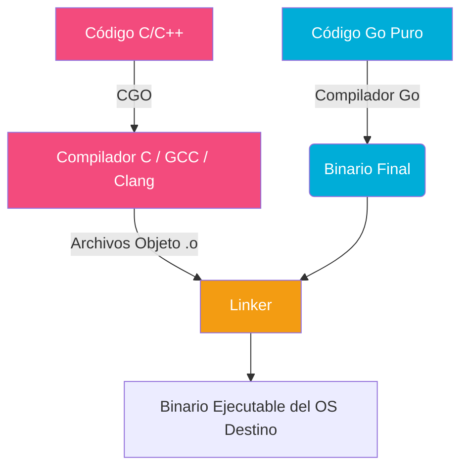
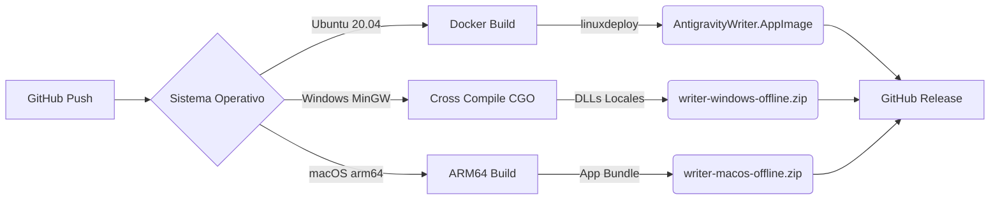

# Magia Negra: Cross-Compilation, CGO y Empaquetado en Go

Este documento es una guía exhaustiva para entender cómo hemos logrado compilar una aplicación compleja escrita en Go (que incluye inteligencia artificial en C++ y bindings de Rust) para **Linux, Windows y macOS** desde un único entorno. 

Si alguna vez te has peleado con errores de _Linker_, dependencias que faltan en Windows, o incompatibilidades de _glibc_ en Linux, este documento te explicará el **por qué** y el **cómo**.

---

## 1. El Reto: Go Puro vs CGO

Go es famoso por su facilidad para la compilación cruzada (*cross-compilation*). Si tu código es Go 100% puro, compilar para Windows desde Linux es tan fácil como:
```bash
GOOS=windows GOARCH=amd64 go build .
```

Sin embargo, cuando tu proyecto importa paquetes que usan **CGO** (código C/C++ incrustado, como `whisper.cpp`, `tokenizers` u `onnxruntime`), la magia de Go se rompe. Go ya no puede compilar ese código C, y necesita delegarlo a un **compilador de C externo** que sepa cómo generar código para el sistema operativo objetivo.

### El Flujo de CGO



Para compilar hacia Windows desde Linux, necesitamos usar un compilador como **MinGW** (`x86_64-w64-mingw32-gcc`).

---

## 2. Diseccionando los Flags del Compilador

Cuando usamos un compilador externo, debemos decirle exactamente dónde encontrar los archivos de cabecera (`.h`) y las librerías precompiladas (`.a` o `.dll`/`.so`). Aquí entran en juego las variables de entorno de CGO.

### `CGO_CFLAGS`
Le dice al compilador de C dónde encontrar las cabeceras.
- **Ejemplo:** `-I/ruta/a/whisper.cpp/include` (La `I` significa *Include*).

### `CGO_LDFLAGS`
Le dice al **Linker** (el enlazador) dónde encontrar las librerías y cómo pegarlas en nuestro ejecutable. Aquí es donde ocurre el 90% del sufrimiento.

- **`-L/ruta/a/libs`**: Busca librerías en este directorio (*Library path*).
- **`-lwhisper`**: Enlaza la librería llamada `libwhisper.a` (o `.so`).
- **`-static-libstdc++` y `-static-libgcc`**: 
  > [!TIP]
  > **El Salvavidas de Windows.** Por defecto, MinGW asume que el ordenador Windows tendrá instaladas sus librerías de C++. Si no las tiene, Windows lanza un error emergente de "Falta libstdc++-6.dll". Estos flags obligan al compilador a **incrustar** el código de esas librerías dentro de tu `.exe`, haciéndolo totalmente portable sin instalaciones previas.
- **`-Wl,-Bstatic` y `-Wl,-Bdynamic`**: Todo lo que vaya después de `-Bstatic` se pegará DENTRO del ejecutable. Todo lo que vaya después de `-Bdynamic` se buscará dinámicamente en el sistema (por ejemplo, las DLLs nativas de Windows como `-lntdll`).

---

## 3. El Infierno del Orden de Enlazado (Linking Order)

En C y C++, **el orden en el que le pasas las librerías al Linker importa, y mucho**. Si la librería `A` depende de la librería `B`, la librería `A` **debe escribirse antes** en el comando del compilador.

```mermaid
sequenceDiagram
    participant Linker
    participant LibA (Tokenizers)
    participant LibB (Windows Native: ntdll)
    
    Note over Linker, LibB: INTENTO INCORRECTO (B va antes que A)
    Linker->>LibB: ¿Necesitas algo?
    LibB-->>Linker: No, no necesito nada. (El Linker la descarta)
    Linker->>LibA: ¿Necesitas algo?
    LibA-->>Linker: ¡Sí! Necesito "RtlNtStatusToDosError" (que está en B)
    Linker-->>Linker: ERROR: Undefined reference! (Ya tiré a la basura la LibB)

    Note over Linker, LibB: INTENTO CORRECTO (A va antes que B)
    Linker->>LibA: ¿Necesitas algo?
    LibA-->>Linker: Necesito "RtlNtStatusToDosError"
    Linker->>Linker: Anota el símbolo como "Pendiente"
    Linker->>LibB: ¿Necesitas algo? ¿Tienes "RtlNtStatusToDosError"?
    LibB-->>Linker: Yo lo tengo. Te lo doy.
    Linker->>Linker: ÉXITO: Símbolo resuelto.
```

### El Problema Específico de Go (`-extldflags`)
Go compila paquete por paquete. Si pasas flags globales en `CGO_LDFLAGS`, Go los coloca **antes** de los flags individuales de los paquetes de terceros (como `tokenizers`). Esto causa que librerías base de Windows (como `ntdll`) se descarten antes de ser usadas.

**La Solución Mágica:**
Añadir `-ldflags "-linkmode external -extldflags '-lntdll -lbcrypt'"` al comando `go build`. 
Esto fuerza a Go a no intentar probar enlaces internos y empuja estas librerías al final absoluto del comando del linker externo, asegurando que resuelvan cualquier dependencia residual de todos los paquetes.

---

## 4. Estrategias por Plataforma

Para lograr la verdadera portabilidad sin volver loco al usuario, usamos estrategias distintas por sistema operativo:

### 🐧 Linux: El Ecosistema Fragmentado (AppImage)
**El Problema**: Linux no es un sistema operativo único, son cientos de distribuciones con diferentes versiones de `glibc` (la librería C estándar) y GTK. Si compilas en Ubuntu 24.04, el binario usará símbolos de un `glibc` muy moderno que no existe en Debian 12 o Ubuntu 20.04, resultando en un error fatal (`/lib/x86_64-linux-gnu/libc.so.6: version 'GLIBC_2.32' not found`).

**La Solución**:
1. **Compilar en Viejo**: Usamos Docker con Ubuntu 20.04. Los binarios de Linux son "compatibles hacia adelante". Si compilas con un glibc viejo, funcionará en distribuciones modernas (pero no al revés).
2. **Empaquetar TODO (AppImage)**: Usamos `linuxdeploy` y `linuxdeploy-plugin-gtk`. Esta herramienta usa el comando `ldd` para escanear nuestro binario, detecta TODAS las librerías compartidas de las que depende (WebKit, GTK, Pango, libc) y las mete dentro de un directorio cerrado (`AppDir`). Luego lo comprime todo en un único archivo ejecutable (`.AppImage`).

### 🪟 Windows: DLLs y Static Linking
**El Problema**: Windows no tiene un gestor de paquetes unificado. Depender de librerías externas significa pedirle al usuario que instale cosas raras.

**La Solución**:
Incrustar todo lo posible estáticamente (`-static-libstdc++`) y distribuir el resto como librerías dinámicas locales (`.dll`) junto al `.exe` en un `.zip`. En Windows, si una DLL está en la misma carpeta que el `.exe`, el sistema la cargará automáticamente, aislando la aplicación del resto del sistema.

### 🍏 macOS: La Trampa de las Arquitecturas y el Formato Estático
**El Problema**: macOS está en una transición. La mitad de los usuarios usa Intel (`x86_64`) y la otra mitad usa Apple Silicon (`arm64`). Al principio intentamos hacer **Universal Binaries** (`-DCMAKE_OSX_ARCHITECTURES="arm64;x86_64"`).
Sin embargo, nos topamos con dos grandes muros:
1. **Falta de librerías universales:** La librería externa `tokenizers` solo distribuye su versión precompilada para `darwin-arm64`. Al intentar enlazar el binario universal, el *linker* explotaba con `Undefined symbols for architecture x86_64: _tokenizers_decode` porque le faltaba la mitad Intel de esa librería.
2. **Dynamic vs Static:** CMake en macOS tiende a construir librerías compartidas (`.dylib`) por defecto, lo que hacía que nuestra consolidación de archivos estáticos (`*.a`) ignorara a `libggml`, provocando un error `ld: library 'ggml' not found`.

**La Solución**:
1. **Abrazar ARM64:** Abandonamos la utopía *Universal*. Los runners actuales de macOS en Github Actions son Apple Silicon (M1). Ahora construimos exclusivamente para `arm64`, lo que nos garantiza compatibilidad perfecta con nuestra librería `tokenizers` nativa.
2. **Forzar Static Linking:** Inyectamos `-DBUILD_SHARED_LIBS=OFF` explícitamente en el comando `cmake` de macOS para obligarle a generar `libggml.a` y poder embeberla dentro de nuestra aplicación, igual que hacemos en Linux.

---

## 5. Lecciones Oscuras de GitHub Actions (CI/CD)

Al automatizar este proceso en Github Actions usando una `strategy.matrix`, descubrimos una trampa mortal con las **cachés**.

**El problema del "Envenenamiento de Caché" (Cache Poisoning)**:
Nuestro pipeline lanza trabajos paralelos para Linux y Windows. Dado que ambos trabajos se ejecutan sobre máquinas host `ubuntu-latest` (Windows se construye mediante *cross-compilation* usando MinGW), la variable de entorno de GitHub `${{ runner.os }}` evaluaba como `Linux` en ambos casos.

Nuestra clave original de caché era:
`key: $${{ runner.os }}-assets-v4-...`

1. El job de **Windows** terminaba rápido, guardando en caché su carpeta `lib/` (que solo contenía sus `.dll` locales y no necesitaba descargar `libtokenizers` para Linux). Lo guardaba bajo la clave `Linux-assets-v4-XYZ`.
2. El job de **Linux**, o una ejecución posterior de Linux, encontraba esa caché, decía "¡Acierto!", la restauraba y se saltaba el paso de descarga.
3. El compilador de Linux llegaba al final y moría con `/usr/bin/ld: cannot find -ltokenizers` porque el job de Windows le había sobrescrito la caché con carpetas vacías.

**La Solución**:
Aislar las cachés usando variables inmutables de nuestra matriz (`matrix.platform` en lugar de `runner.os`). De esta forma, el job de Windows guarda en `windows-assets-vX` y el de Linux en `linux-assets-vX`, evitando que se pisen la manguera.

---

## Resumen del Pipeline CI/CD



> [!NOTE]
> La compilación cruzada en CGO parece un arte oscuro al principio, pero una vez que entiendes que todo se reduce a decirle al Linker **dónde están las piezas y en qué orden debe unirlas**, el control total vuelve a tus manos.
