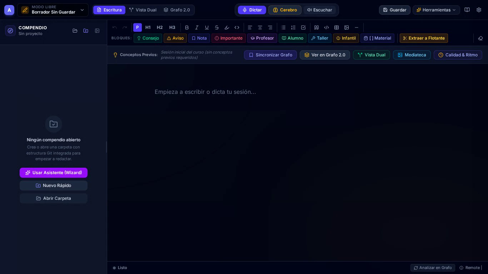

# 🌌 Antigravity Writer

> **Entorno de autoría estructurada, inteligencia semántica local y pedagogía sin fricción.**  
> *«Escribir primero y organizar después, garantizando siempre la coherencia conceptual.»*

[](https://golang.org)
[](https://wails.io)
[](https://reactjs.org)
[](https://github.com/ggerganov/whisper.cpp)
[](https://github.com/fastino-ai/GLiNER2)
[](https://opensource.org/licenses/MIT)

---

## 🎯 ¿Qué es Antigravity Writer?

**Antigravity Writer** es una aplicación de escritorio diseñada para formadores, educadores, catequistas, ingenieros y autores de compendios de conocimiento. Su objetivo es eliminar el bloqueo creativo y la parálisis por organización previa, ofreciendo un flujo de trabajo donde el autor vuelca libremente sus ideas y el sistema analiza, conecta y organiza el material de forma continua y 100% privada en local.

---

## ✨ Características Principales

### 🧠 1. Inteligencia Semántica y Extracción de Grafos (GLiNER2 Local)
- **Extracción de Entidades y Relaciones**: Motor local **ONNX Runtime** que identifica conceptos pedagógicos/doctrinales y relaciones como `prerrequisito_de`, `profundiza_en` o `asociado_con`.
- **Sincronización Local vs Global**: Cada sesión genera su propio subgrafo (`.writer/graphs/<archivo>.json`) que se consolida de forma idempotente en el **Grafo Global del Curso** (`.writer/graph-global.json`).
- **Validador Curricular (*Knowledge Linter*)**: Detección visual en **IdeaGraph 2.0** de ciclos conceptuales, saltos pedagógicos y nodos huérfanos.

### 🎙️ 2. Motor de Audio y Dictado por Voz (Whisper.cpp Integrado)
- **Transcripción 100% Offline**: Inferencia local en CPU/GPU mediante modelos GGML (`tiny`, `base`, `small`) sin enviar un solo byte de audio a la nube.
- **Medidor de Volumen en Tiempo Real (VU Meter)**: Monitor interactivo de señal para validar el micrófono antes y durante la grabación.
- **Modo TTT (Text-to-Text)**: Entrada directa de instrucciones o notas de texto para autores que prefieren no hablar.
- **Captura Rápida de Voz (`Voice Braindump`)**: Grabación instantánea de notas efímeras en la bandeja flotante con extracción semántica inmediata.

### 🧩 3. Bandeja de Ideas Flotantes y Asistente de Reubicación
- **Bandeja de Ideas Desacopladas (`content/unassigned/`)**: Almacén para reflexiones y actividades que aún no tienen una semana o clase asignada.
- **Semáforo de Madurez (`Readiness Badges`)**:
  - 🟢 **Listo**: Todos los conceptos previos requeridos ya han sido enseñados en sesiones anteriores.
  - 🟡 **Bloqueado**: La idea requiere conceptos que aún no han sido introducidos formalmente.
  - 🟣 **Raíz**: Concepto introductorio autónomo.
- **Asistente de Reubicación por Dependencias (Icono 🧭)**: Algoritmo bayesiano que analiza el grafo y sugiere la semana/módulo óptimo, permitiendo:
  - *Promover como Nueva Sesión* (`sesion-XX.adoc`).
  - *Incrustar en Sesión Existente* (como subtema `===` o bloque `[NOTE]`).
- **Extracción de Selección (*Selection-to-Floating-Idea*)**: Poda de párrafos desviados en el editor que se transforman en una nota flotante con enlace de referencia automático `xref:`.

### 📊 4. Matriz de Coherencia Curricular (Mapa de Calor)
- **Auditoría Pedagógica Visual**: Matriz interactiva de sesiones (columnas) vs conceptos (filas).
- **Indicadores Clave**:
  - ★ **Introducción**: Primera vez que se explica formalmente el concepto.
  - ● **Refuerzo / Mención**: Sesiones posteriores que consolidan el concepto.
  - ⚠️ **Uso Prematuro**: Alerta cuando se utiliza un concepto antes de su explicación fundacional.

### 💾 5. Arquitectura Local-First con Git Nativo
- **Almacenamiento Estándar**: Documentos en formato AsciiDoc / Markdown con frontmatter estructurado.
- **Control de Versiones Transparente**: Motor Git incrustado en Go puro (`go-git`) con auto-commits atómicos y navegador temporal de versiones.
- **Doble Publicación con Hugo**: Generación automática de portada de curso, manuales de alumno/instructor y DevLog / Bitácora pedagógica con despliegue a GitHub Pages.

---

## 🛠️ Instalación y Puesta en Marcha

### Prerrequisitos
- **Go**: 1.22 o superior
- **Node.js**: 18+ y npm
- **Wails CLI**: `go install github.com/wailsapp/wails/v2/cmd/wails@latest`
- **Compilador C/C++**: `gcc` / `g++` y `cmake`

### Modo Desarrollo
```bash
# Instalar dependencias del frontend
cd frontend && npm install && cd ..

# Iniciar aplicación en modo desarrollo (Hot-Reload)
wails dev
```

### Compilación de Binarios
```bash
# Compilar para Linux (con suite de pruebas integrada)
make build-linux

# Compilar para Windows (Cross-compilation desde Linux con MinGW)
make build-windows

# Empaquetado completo para distribución offline
make package-linux
```

> [!TIP]
> Para detalles exhaustivos sobre la configuración cruzada de CGO y bibliotecas compartidas (ONNX Runtime, Whisper), consulta la [Guía de Compilación Cruzada](./CROSS_COMPILE.md).

---

## 🤖 Integración con LLMs (Servidor MCP)

Antigravity Writer incluye un servidor MCP (*Model Context Protocol*) nativo en el puerto `3000` (`http://localhost:3000/mcp`) que permite a asistentes de IA como Claude o Gemini interactuar directamente con el editor mediante las herramientas:
- `insert_text`: Inserción controlada de contenido.
- `get_editor_content`: Lectura del estado actual de redacción.

---

## 🎬 Masterclass Completa: De la Idea al Compendio Editorial (15 min)

Antigravity Writer cuenta con una **Masterclass Audiovisual Integral** en 10 capítulos (15:25 minutos) producida automáticamente con navegación real de pantalla en 1080p, locución neural en español (Kokoro TTS a -14 LUFS) y subtítulos sincronizados.

[](./docs/tutorials/masterclass_completa_antigravity_writer.mp4)

> 📺 **[🌐 Abrir Visor Web Interactivo de la Masterclass](./docs/tutorials/visor_masterclass.html)** *(Reproductor con índice de capítulos interactivo, selector de velocidad y subtítulos)*  
> 📹 **[🎬 Ver / Descargar Vídeo Unificado MP4 (15:25 min)](./docs/tutorials/masterclass_completa_antigravity_writer.mp4)** • **[💬 Subtítulos SRT](./docs/tutorials/masterclass_completa_subtitulos.srt)** • **[📝 Ficha y Marcas de Tiempo de YouTube](./docs/tutorials/YOUTUBE_DESCRIPCION.md)**

| # | Cap. / Tiempo | Título y Enfoque Temático | Recursos |
| :-: | :---: | :--- | :---: |
| **01** | `00:00` | **Introducción y Paradigma: «Escribir sin miedo al orden»** *(Interfaz dual, lienzo AsciiDoc y Git invisible)* | [📖 Material](./docs/tutorials/capitulo_1/material_didactico.md) • [🎬 MP4](./docs/tutorials/capitulo_1/output/capitulo_1_masterclass.mp4) |
| **02** | `02:32` | **Motor de Voz Local & Dictado con Whisper** *(VU Meter en vivo, selección de modelos GGML y modo TTT)* | [📖 Material](./docs/tutorials/capitulo_2/material_didactico.md) • [🎬 MP4](./docs/tutorials/capitulo_2/output/capitulo_2_masterclass.mp4) |
| **03** | `04:19` | **Extracción Semántica & Grafos con GLiNER2** *(Entidades ontológicas y sincronización de grafo local/global)* | [📖 Material](./docs/tutorials/capitulo_3/material_didactico.md) • [🎬 MP4](./docs/tutorials/capitulo_3/output/capitulo_3_masterclass.mp4) |
| **04** | `05:43` | **Bandeja de Ideas Flotantes & Semáforos de Madurez** *(Buffer sin asignar, Readiness Badges y prerrequisitos)* | [📖 Material](./docs/tutorials/capitulo_4/material_didactico.md) • [🎬 MP4](./docs/tutorials/capitulo_4/output/capitulo_4_masterclass.mp4) |
| **05** | `07:07` | **Extracción de Selección a Idea Flotante** *(Podar lecciones sobrecargadas con enlaces xref automáticos)* | [📖 Material](./docs/tutorials/capitulo_5/material_didactico.md) • [🎬 MP4](./docs/tutorials/capitulo_5/output/capitulo_5_masterclass.mp4) |
| **06** | `08:30` | **Asistente de Reubicación por Dependencias (🧭)** *(Diagnóstico del grafo: nueva sesión vs incrustar)* | [📖 Material](./docs/tutorials/capitulo_6/material_didactico.md) • [🎬 MP4](./docs/tutorials/capitulo_6/output/capitulo_6_masterclass.mp4) |
| **07** | `09:54` | **Matriz de Coherencia Curricular (Heatmap)** *(Validación de prerrequisitos y alertas de uso prematuro)* | [📖 Material](./docs/tutorials/capitulo_7/material_didactico.md) • [🎬 MP4](./docs/tutorials/capitulo_7/output/capitulo_7_masterclass.mp4) |
| **08** | `11:18` | **IdeaGraph 2.0 & Validador Curricular** *(Lienzo 2D interactivo, detección de ciclos y nodos huérfanos)* | [📖 Material](./docs/tutorials/capitulo_8/material_didactico.md) • [🎬 MP4](./docs/tutorials/capitulo_8/output/capitulo_8_masterclass.mp4) |
| **09** | `12:40` | **Derivación de Audiencias & Calidad de Contenido** *(Single-Source Authoring, Vista Dual y calculadora de ritmo)* | [📖 Material](./docs/tutorials/capitulo_9/material_didactico.md) • [🎬 MP4](./docs/tutorials/capitulo_9/output/capitulo_9_masterclass.mp4) |
| **10** | `13:57` | **Compendium Wizard, Prompt Studio y Git Sync** *(Esqueletos plurianuales de 60 semanas, Canva y Git remoto)* | [📖 Material](./docs/tutorials/capitulo_10/material_didactico.md) • [🎬 MP4](./docs/tutorials/capitulo_10/output/capitulo_10_masterclass.mp4) |

---

## 📚 Documentación y Recursos

Para profundizar en la arquitectura y uso pedagógico de la herramienta:

1. 📖 **[Manual de Usuario y Guía Pedagógica](./docs/MANUAL_DE_USUARIO.md)**: Manual completo de la aplicación y flujos de trabajo recomendados.
2. 🕸️ **[Arquitectura de Grafos y GLiNER2](./docs/ARQUITECTURA_GRAFOS.md)**: Explicación formal de la ontología, fusión idempotente y resolución de dependencias.
3. ⚙️ **[Guía de Configuración](./CONFIG_GUIDE.md)**: Parámetros del motor de audio, modelos y dispositivos.
4. 📋 **[Roadmap y Estado del Proyecto (TODO.md)](./TODO.md)**: Historial de características implementadas y objetivos futuros.
5. 🎥 **[Centro de Masterclass y Prompts IA](./docs/VIDEOTUTORIALES_Y_MASTERCLASS.md)**: Acceso a todos los prompts para Gemini Studio y guías de Google NotebookLM.