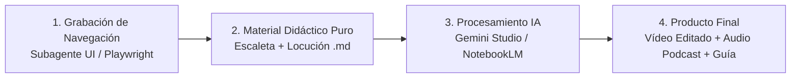

# 🎥 Videotutoriales, Guiones de Producción y Masterclass

Bienvenido al centro de recursos audiovisuales y guiones pedagógicos de **Antigravity Writer**. Aquí se recopilan los materiales didácticos, las grabaciones de navegación en alta definición de cada prueba y los flujos para procesar el contenido con **Gemini Multimodal** o **Google NotebookLM**.

---

## 🧭 Flujo de Producción de Contenidos

---

## 📚 Índice de Capítulos del Curso

| Cap. | Título y Enfoque | Material Didáctico | Grabación / Vídeo Demo | Prompts & Guías IA | Salida Final |
| :---: | :--- | :---: | :---: | :---: | :---: |
| **01** | **Introducción y Paradigma: «Escribir sin miedo al orden»** *(Interfaz Dual: Editor AsciiDoc + Árbol del Compendio + Git)* | [📖 Material](./tutorials/capitulo_1/material_didactico.md) | [🎥 Ver Vídeo (WebP)](./tutorials/capitulo_1/navegacion_capitulo_1.webp) | [🤖 Prompt Gemini](./tutorials/capitulo_1/prompt_gemini.md) [📓 Guía NotebookLM](./tutorials/capitulo_1/guia_notebooklm.md) | *Pendiente* |
| **02** | **Motor de Voz Local & Dictado con Whisper** *(VU Meter, captura rápida por voz y modo TTT)* | *En desarrollo* | *En desarrollo* | *En desarrollo* | *—* |
| **03** | **Extracción Semántica & Grafos con GLiNER2** *(Detección de entidades, relaciones y sincronización local/global)* | *En desarrollo* | *En desarrollo* | *En desarrollo* | *—* |
| **04** | **Bandeja de Ideas Flotantes & Semáforos de Madurez** *(Buffer sin asignar, Readiness Badges y notas efímeras)* | *En desarrollo* | *En desarrollo* | *En desarrollo* | *—* |
| **05** | **Selección a Idea Flotante (*Selection-to-Floating-Idea*)** *(Podar y modularizar lecciones con enlaces xref AsciiDoc)* | *En desarrollo* | *En desarrollo* | *En desarrollo* | *—* |
| **06** | **Asistente de Reubicación por Dependencias (Icono 🧭)** *(Motor bayesiano de ordenación y opción Nueva Sesión vs Incrustar)* | *En desarrollo* | *En desarrollo* | *En desarrollo* | *—* |
| **07** | **Matriz de Coherencia Curricular (Heatmap)** *(Validación de prerrequisitos, refuerzo y alertas de uso prematuro)* | *En desarrollo* | *En desarrollo* | *En desarrollo* | *—* |
| **08** | **IdeaGraph 2.0 & Validador Curricular** *(Inspección visual del grafo, detección de ciclos y nodos huérfanos)* | *En desarrollo* | *En desarrollo* | *En desarrollo* | *—* |
| **09** | **Derivación de Audiencias & Calidad de Contenido** *(Adaptación para niños/jóvenes y métricas de legibilidad)* | *En desarrollo* | *En desarrollo* | *En desarrollo* | *—* |
| **10** | **Compendium Wizard, Prompt Studio y Git Sync** *(Creación estructurada plurianual y flujo colaborativo)* | *En desarrollo* | *En desarrollo* | *En desarrollo* | *—* |

---

## 🎬 Detalle de Recursos del Capítulo 1

- **Material Base**: [docs/tutorials/capitulo_1/material_didactico.md](./tutorials/capitulo_1/material_didactico.md) *(Contenido puro sin prompts mezclados)*
- **Vídeo de Navegación UI**: [docs/tutorials/capitulo_1/navegacion_capitulo_1.webp](./tutorials/capitulo_1/navegacion_capitulo_1.webp)
- **Instrucciones para IA**:
  - [🤖 Prompt para Gemini (AI Studio / Web)](./tutorials/capitulo_1/prompt_gemini.md)
  - [📓 Guía para Google NotebookLM (Audio Overview & Study Guide)](./tutorials/capitulo_1/guia_notebooklm.md)
- **Entregables Finales (Espacio reservado)**:
  - [ ] `docs/tutorials/capitulo_1/capitulo_didactico.md` *(Lección escrita final)*
  - [ ] `docs/tutorials/capitulo_1/subtitulos.srt` *(Pista de subtítulos)*
  - [ ] *(Enlace al Audio Podcast generado por NotebookLM / Vídeo final)*
