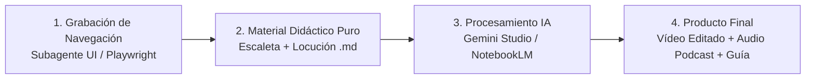

# 🎥 Videotutoriales, Guiones de Producción y Masterclass

Bienvenido al centro de recursos audiovisuales y guiones pedagógicos de **Antigravity Writer**. Aquí se recopilan los materiales didácticos, las grabaciones de navegación en alta definición y los recursos listos para procesar con **Gemini Multimodal** o **Google NotebookLM**.

---

## 🧭 Flujo de Producción de Contenidos

---

## 📚 Índice de los 10 Capítulos de la Masterclass

| Cap. | Título y Enfoque | Material Didáctico | Vídeo Demo | Prompts & Guías IA | Salida Final |
| :---: | :--- | :---: | :---: | :---: | :---: |
| **01** | **Introducción y Paradigma: «Escribir sin miedo al orden»** *(Interfaz Dual: Editor AsciiDoc + Árbol del Compendio + Git)* | [📖 Material](./tutorials/capitulo_1/material_didactico.md) | [🎥 Ver Vídeo (WebP)](./tutorials/capitulo_1/navegacion_capitulo_1.webp) | [🤖 Prompt Gemini](./tutorials/capitulo_1/prompt_gemini.md) [📓 Guía NotebookLM](./tutorials/capitulo_1/guia_notebooklm.md) | **✅ Generado** • [🎬 Vídeo MP4 (Kokoro Sync)](./tutorials/capitulo_1/output/capitulo_1_masterclass.mp4) • [💬 Subtítulos SRT](./tutorials/capitulo_1/output/capitulo_1_subtitulos.srt) • [🎵 Audio Master WAV](./tutorials/capitulo_1/output/master_audio.wav) |
| **02** | **Motor de Voz Local & Dictado con Whisper** *(VU Meter en tiempo real, modelos GGML y modo TTT)* | [📖 Material](./tutorials/capitulo_2/material_didactico.md) | *Sincronizado* | [🤖 Prompt Gemini](./tutorials/capitulo_2/prompt_gemini.md) [📓 Guía NotebookLM](./tutorials/capitulo_2/guia_notebooklm.md) | **✅ Generado** • [🎬 Vídeo MP4 (Kokoro Sync)](./tutorials/capitulo_2/output/capitulo_2_masterclass.mp4) • [💬 Subtítulos SRT](./tutorials/capitulo_2/output/capitulo_2_subtitulos.srt) • [🎵 Audio Master WAV](./tutorials/capitulo_2/output/master_audio.wav) |
| **03** | **Extracción Semántica & Grafos con GLiNER2** *(Entidades ontológicas, relaciones y sincronización local/global)* | [📖 Material](./tutorials/capitulo_3/material_didactico.md) | *Pendiente* | [🤖 Prompt Gemini](./tutorials/capitulo_3/prompt_gemini.md) [📓 Guía NotebookLM](./tutorials/capitulo_3/guia_notebooklm.md) | *Pendiente* |
| **04** | **Bandeja de Ideas Flotantes & Semáforos de Madurez** *(Buffer sin asignar, Readiness Badges y notas efímeras)* | [📖 Material](./tutorials/capitulo_4/material_didactico.md) | *Pendiente* | [🤖 Prompt Gemini](./tutorials/capitulo_4/prompt_gemini.md) [📓 Guía NotebookLM](./tutorials/capitulo_4/guia_notebooklm.md) | *Pendiente* |
| **05** | **Selección a Idea Flotante (*Selection-to-Floating-Idea*)** *(Podar lecciones sobrecargadas con enlaces xref AsciiDoc)* | [📖 Material](./tutorials/capitulo_5/material_didactico.md) | *Pendiente* | [🤖 Prompt Gemini](./tutorials/capitulo_5/prompt_gemini.md) [📓 Guía NotebookLM](./tutorials/capitulo_5/guia_notebooklm.md) | *Pendiente* |
| **06** | **Asistente de Reubicación por Dependencias (Icono 🧭)** *(Motor pedagógico de ordenación y opción Nueva Sesión vs Incrustar)* | [📖 Material](./tutorials/capitulo_6/material_didactico.md) | *Pendiente* | [🤖 Prompt Gemini](./tutorials/capitulo_6/prompt_gemini.md) [📓 Guía NotebookLM](./tutorials/capitulo_6/guia_notebooklm.md) | *Pendiente* |
| **07** | **Matriz de Coherencia Curricular (Heatmap)** *(Validación de prerrequisitos, refuerzo y alertas de uso prematuro)* | [📖 Material](./tutorials/capitulo_7/material_didactico.md) | *Pendiente* | [🤖 Prompt Gemini](./tutorials/capitulo_7/prompt_gemini.md) [📓 Guía NotebookLM](./tutorials/capitulo_7/guia_notebooklm.md) | *Pendiente* |
| **08** | **IdeaGraph 2.0 & Validador Curricular** *(Lienzo interactivo 2D, detección de ciclos y nodos huérfanos)* | [📖 Material](./tutorials/capitulo_8/material_didactico.md) | *Pendiente* | [🤖 Prompt Gemini](./tutorials/capitulo_8/prompt_gemini.md) [📓 Guía NotebookLM](./tutorials/capitulo_8/guia_notebooklm.md) | *Pendiente* |
| **09** | **Derivación de Audiencias & Calidad de Contenido** *(Single-Source Authoring, vista dual y calculadora de ritmo de clase)* | [📖 Material](./tutorials/capitulo_9/material_didactico.md) | *Pendiente* | [🤖 Prompt Gemini](./tutorials/capitulo_9/prompt_gemini.md) [📓 Guía NotebookLM](./tutorials/capitulo_9/guia_notebooklm.md) | *Pendiente* |
| **10** | **Compendium Wizard, Prompt Studio y Git Sync** *(Esqueletos plurianuales de 60 semanas, Canva, vídeos y Git remoto)* | [📖 Material](./tutorials/capitulo_10/material_didactico.md) | *Pendiente* | [🤖 Prompt Gemini](./tutorials/capitulo_10/prompt_gemini.md) [📓 Guía NotebookLM](./tutorials/capitulo_10/guia_notebooklm.md) | *Pendiente* |

---

## 🎬 Detalle de Recursos por Capítulo

### Capítulo 1: Introducción y Paradigma — «Escribir sin miedo al orden»
- [📖 Material Didáctico](./tutorials/capitulo_1/material_didactico.md)
- [🎥 Clip de Navegación UI (WebP)](./tutorials/capitulo_1/navegacion_capitulo_1.webp)
- [🤖 Prompt para Gemini](./tutorials/capitulo_1/prompt_gemini.md)
- [📓 Guía para Google NotebookLM](./tutorials/capitulo_1/guia_notebooklm.md)
- **Entregables Finales Generados por el Orquestador**:
  - [x] [🎬 `capitulo_1_masterclass.mp4`](./tutorials/capitulo_1/output/capitulo_1_masterclass.mp4) *(Vídeo final 1080p con locución en español generada por Kokoro TTS)*
  - [x] [💬 `capitulo_1_subtitulos.srt`](./tutorials/capitulo_1/output/capitulo_1_subtitulos.srt) *(Pista de subtítulos sincronizada)*
  - [x] [🎵 `master_audio.wav`](./tutorials/capitulo_1/output/master_audio.wav) *(Pista completa de audio)*

### Capítulo 2: Motor de Voz Local & Dictado con Whisper
- [📖 Material Didáctico](./tutorials/capitulo_2/material_didactico.md)
- [🤖 Prompt para Gemini](./tutorials/capitulo_2/prompt_gemini.md)
- [📓 Guía para Google NotebookLM](./tutorials/capitulo_2/guia_notebooklm.md)
- **Entregables Finales Generados por el Orquestador**:
  - [x] [🎬 `capitulo_2_masterclass.mp4`](./tutorials/capitulo_2/output/capitulo_2_masterclass.mp4) *(Vídeo final 1080p con locución en español generada por Kokoro TTS)*
  - [x] [💬 `capitulo_2_subtitulos.srt`](./tutorials/capitulo_2/output/capitulo_2_subtitulos.srt) *(Pista de subtítulos sincronizada)*
  - [x] [🎵 `master_audio.wav`](./tutorials/capitulo_2/output/master_audio.wav) *(Pista completa de audio)*

### Capítulo 3: Extracción Semántica & Grafos con GLiNER2
- [📖 Material Didáctico](./tutorials/capitulo_3/material_didactico.md)
- [🤖 Prompt para Gemini](./tutorials/capitulo_3/prompt_gemini.md)
- [📓 Guía para Google NotebookLM](./tutorials/capitulo_3/guia_notebooklm.md)

### Capítulo 4: Bandeja de Ideas Flotantes & Semáforos de Madurez
- [📖 Material Didáctico](./tutorials/capitulo_4/material_didactico.md)
- [🤖 Prompt para Gemini](./tutorials/capitulo_4/prompt_gemini.md)
- [📓 Guía para Google NotebookLM](./tutorials/capitulo_4/guia_notebooklm.md)

### Capítulo 5: Extracción de Selección a Idea Flotante
- [📖 Material Didáctico](./tutorials/capitulo_5/material_didactico.md)
- [🤖 Prompt para Gemini](./tutorials/capitulo_5/prompt_gemini.md)
- [📓 Guía para Google NotebookLM](./tutorials/capitulo_5/guia_notebooklm.md)

### Capítulo 6: Asistente de Reubicación por Dependencias (Icono 🧭)
- [📖 Material Didáctico](./tutorials/capitulo_6/material_didactico.md)
- [🤖 Prompt para Gemini](./tutorials/capitulo_6/prompt_gemini.md)
- [📓 Guía para Google NotebookLM](./tutorials/capitulo_6/guia_notebooklm.md)

### Capítulo 7: Matriz de Coherencia Curricular (Heatmap)
- [📖 Material Didáctico](./tutorials/capitulo_7/material_didactico.md)
- [🤖 Prompt para Gemini](./tutorials/capitulo_7/prompt_gemini.md)
- [📓 Guía para Google NotebookLM](./tutorials/capitulo_7/guia_notebooklm.md)

### Capítulo 8: IdeaGraph 2.0 & Validador Curricular
- [📖 Material Didáctico](./tutorials/capitulo_8/material_didactico.md)
- [🤖 Prompt para Gemini](./tutorials/capitulo_8/prompt_gemini.md)
- [📓 Guía para Google NotebookLM](./tutorials/capitulo_8/guia_notebooklm.md)

### Capítulo 9: Derivación de Audiencias & Calidad de Contenido
- [📖 Material Didáctico](./tutorials/capitulo_9/material_didactico.md)
- [🤖 Prompt para Gemini](./tutorials/capitulo_9/prompt_gemini.md)
- [📓 Guía para Google NotebookLM](./tutorials/capitulo_9/guia_notebooklm.md)

### Capítulo 10: Compendium Wizard, Prompt Studio y Git Sync
- [📖 Material Didáctico](./tutorials/capitulo_10/material_didactico.md)
- [🤖 Prompt para Gemini](./tutorials/capitulo_10/prompt_gemini.md)
- [📓 Guía para Google NotebookLM](./tutorials/capitulo_10/guia_notebooklm.md)
